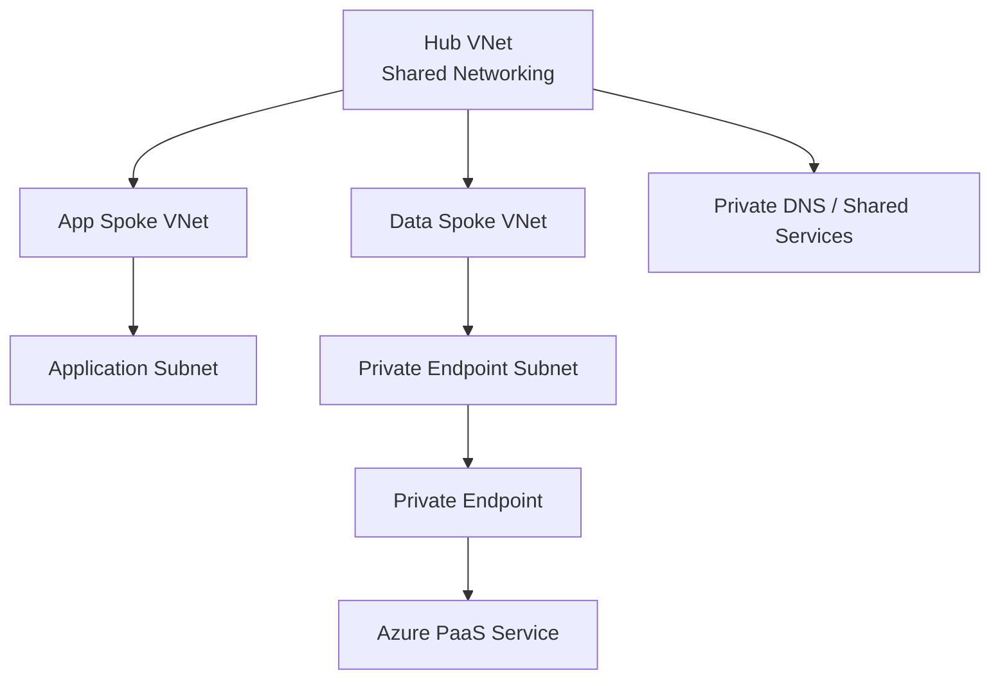

# Azure Enterprise Network

An Azure Cloud Engineering portfolio project focused on designing and operating an enterprise-style network using **Terraform-first Infrastructure as Code**.

This project is intentionally separate from the highly available web application project. The goal here is to go deeper into **Azure networking, private connectivity, DNS, routing, security, monitoring, and troubleshooting**.

## Project Status

**Current phase:** Network design and Terraform foundation  
**Overall progress:** Starting

## Business Scenario

A fictional organisation needs a secure Azure network that can host multiple workloads while keeping shared services centrally managed.

The environment will use a **hub-and-spoke architecture** so that shared networking services can live in the hub while application/data workloads are isolated in separate spokes.

## Target Skills

This project will demonstrate:

- Azure Virtual Networks and subnet design
- CIDR planning
- Hub-and-spoke architecture
- VNet peering
- Network Security Groups
- User Defined Routes
- Private Endpoints
- Azure Private DNS
- Network Watcher / connectivity troubleshooting
- Azure Monitor / Log Analytics
- Terraform-first Infrastructure as Code
- Remote Terraform state
- GitHub Actions CI
- Azure OIDC authentication
- Documentation and architecture diagrams

## Planned Architecture



The final design will evolve as the project progresses. Every major networking decision will be documented with the reason behind it.

## Terraform Structure

```text
terraform/
├── versions.tf
├── providers.tf
├── variables.tf
├── main.tf
└── outputs.tf
```

Terraform will be used **before** resources are created in Azure. This is different from Project 1, where existing resources were later imported into Terraform.

## Project Roadmap

- [x] Create GitHub repository
- [x] Create Terraform project structure
- [ ] Design the IP address plan
- [ ] Build the hub VNet
- [ ] Build application and data spoke VNets
- [ ] Configure VNet peering
- [ ] Design and apply subnet-level NSGs
- [ ] Add routing / UDRs
- [ ] Add Private Endpoint connectivity
- [ ] Configure Azure Private DNS
- [ ] Add monitoring and network diagnostics
- [ ] Configure remote Terraform state
- [ ] Add GitHub Actions validation
- [ ] Configure Azure OIDC authentication
- [ ] Perform deliberate network failure tests
- [ ] Complete final architecture and troubleshooting documentation

## Engineering Approach

For each major task, this repository will document:

```text
Requirement
    ↓
Design decision
    ↓
Terraform implementation
    ↓
Validation
    ↓
Troubleshooting
    ↓
Lesson learned
```

The objective is not only to build a working Azure network, but to demonstrate the reasoning and troubleshooting expected from a Cloud Engineer.
