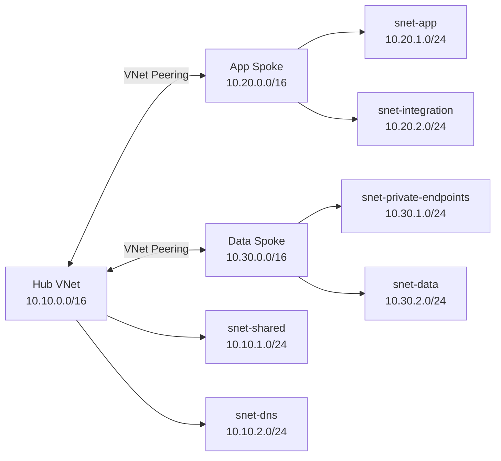

# IP Address Plan

## Why This Exists

The network address plan is designed before Azure resources are deployed.

Hub-and-spoke networks require non-overlapping address spaces. Planning the CIDR ranges first avoids future problems with VNet peering, routing, private connectivity, and hybrid networking.

## VNet Address Spaces

| Network | CIDR | Purpose |
|---|---|---|
| Hub VNet | `10.10.0.0/16` | Shared networking and future central services |
| App Spoke VNet | `10.20.0.0/16` | Application workloads |
| Data Spoke VNet | `10.30.0.0/16` | Private data services and private endpoints |

Each VNet receives its own non-overlapping /16 range.

## Planned Subnets

### Hub VNet — 10.10.0.0/16

| Subnet | CIDR | Purpose |
|---|---|---|
| `snet-shared` | `10.10.1.0/24` | Shared network services / management workloads |
| `snet-dns` | `10.10.2.0/24` | Reserved for DNS/shared name-resolution services |
| `AzureFirewallSubnet` | `10.10.10.0/26` | Reserved for a future Azure Firewall exercise |

Azure Firewall is intentionally not deployed during the initial build to keep the lab cost controlled.

### App Spoke — 10.20.0.0/16

| Subnet | CIDR | Purpose |
|---|---|---|
| `snet-app` | `10.20.1.0/24` | Application workloads |
| `snet-integration` | `10.20.2.0/24` | Reserved for service/VNet integration |

### Data Spoke — 10.30.0.0/16

| Subnet | CIDR | Purpose |
|---|---|---|
| `snet-private-endpoints` | `10.30.1.0/24` | Private Endpoints for Azure PaaS services |
| `snet-data` | `10.30.2.0/24` | Reserved for data-tier workloads |

## Addressing Design

## Design Decisions

### Separate /16 per VNet

Using `10.10.0.0/16`, `10.20.0.0/16`, and `10.30.0.0/16` makes the topology easy to understand and leaves room for additional subnets.

### /24 workload subnets

A /24 is larger than this lab currently requires, but it gives enough address capacity for future workloads without needing immediate subnet redesign.

### Reserved ranges

Not every subnet will be deployed immediately. Reserving address space documents future intent and helps prevent accidental overlap later.

### No spoke-to-spoke peering initially

The application and data spokes will connect through the hub design rather than being directly peered to each other. This gives us a useful platform for learning routing and centralised network control later in the project.
